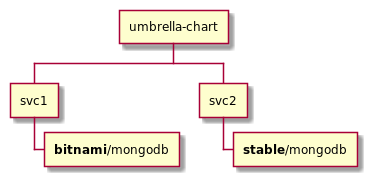

# Helm umbrella charts isolation issue example

This example illustrates the problem with the lack of isolation between the subcharts
defined within a single [Helm](https://helm.sh/) umbrella chart. 
Due to the fact, [that template names are global](https://helm.sh/docs/chart_template_guide/named_templates/),
in the case when at least two different charts share the same prefix but have a different templates structure a conflict may
occur. This repository contains two example scenarios of such a situation.

## Scenarios

### Scenario design

Each scenario consists of:
- simple parent umbrella chart (`umbrella-chart`) with two dependent subcharts `svc1` and `svc2`
- `svc1` and `svc2` charts with some default configuration (generated via `helm create`) and a dependency 
to the [MongoDB](https://www.mongodb.com/) chart from different distributions.

**Provided setup does not reflect any production-ready or recommended configuration - it's purely for illustrating 
the isolation issues between the subcharts.**

### Scenario 1 - Installation fails



In this scenario, an attempt to install `umbrella-chart` via Helm fails with the following message:
```
Error: template: umbrella-chart/charts/svc2/charts/mongodb/templates/NOTES.txt:68:4: executing "umbrella-chart/charts/svc2/charts/mongodb/templates/NOTES.txt" at <include "mongodb.validateValues" .>: error calling include: template: umbrella-chart/charts/svc1/charts/mongodb/templates/_helpers.tpl:174:35: executing "mongodb.validateValues" at <include "mongodb.validateValues.architecture" .>: error calling include: template: umbrella-chart/charts/svc1/charts/mongodb/templates/_helpers.tpl:190:12: executing "mongodb.validateValues.architecture" at <ne .Values.architecture "standalone">: error calling ne: incompatible types for comparison
```

### Scenario 2 - Installation succeeds


Exchanging the dependencies between `svc1` and `svc2` enables a successful installation via `helm install`.
However, due to the _last loaded wins_ strategy for template resolution, we may expect some weird (or hard to predict) 
behavior at runtime.

## Running the examples

**Example scenarios require Helm v3** (tested with v3.4.1).

The `prepare.sh` script could be used to download the required dependencies and prepare the umbrella charts for installation.

When everything is already set up, installation should be rather straightforward:
```
# Scenario 1 - Installation fails
helm install umbrella-chart ./installation-fails/umbrella-chart

# Scenario 2 - Installation succeeds
helm install umbrella-chart ./installation-succeeds/umbrella-chart
# cleanup with:
helm del umbrella-chart
```
